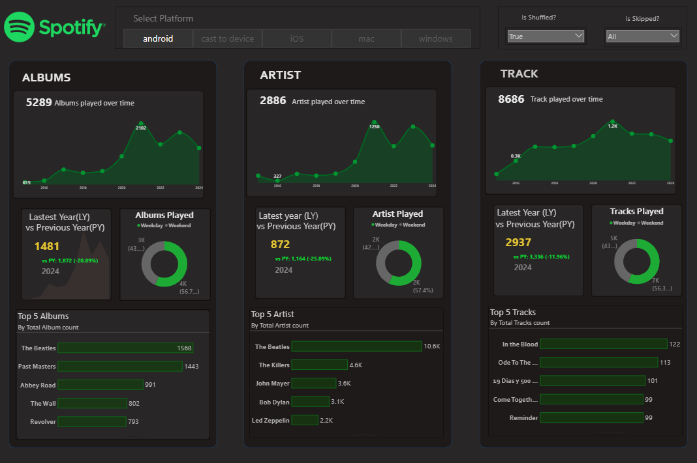
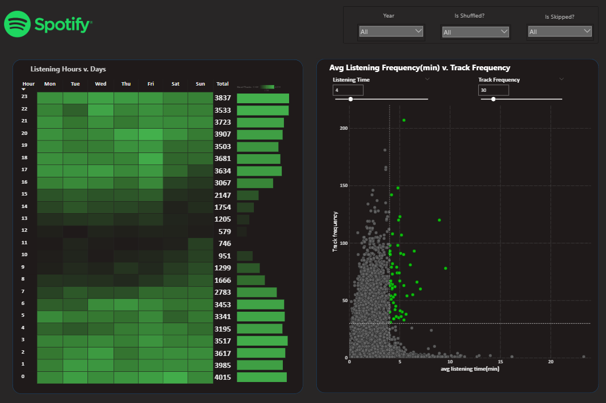
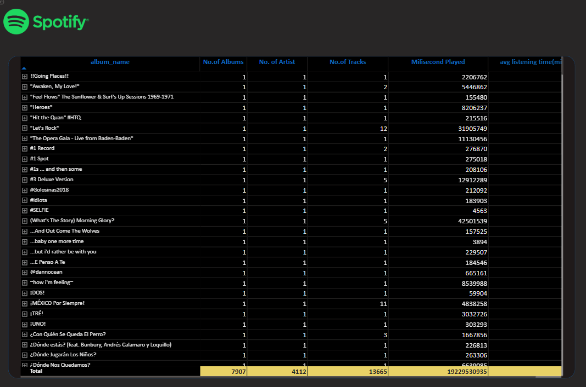

# Spotify-Analysis
A comprehensive end to end analysis project transforming raw spotify listening history into actionable business insights through advanced visualization, DAX modelling, and automated governance frameworks 
# Spotify Listening Data Analysis 🎵

## Project Overview
This project provides a comprehensive analysis of personal Spotify listening history. By processing raw telemetry data, the project uncovers trends in artist preferences, album engagement, and daily listening habits. 

The analysis transitions from raw data processing to high-level business intelligence insights, visualized through interactive dashboards.

## Key Features
- **Artist , Album & Track Metrics:** Identification of Top 5 artists/albums/tracks , Total Albums/Tracks/Artist Played over time, Latest Year vs. Previous Year Analysis , Albums/Artist/Tracks Played on Weekday & Weekend , No. of Albums/Tracks/Artist Listened by Year, YOY Growth analysis.
-  **Listening Hours Analysis:** Identify peak listening times using a Heat Map that visualizes patterns across hours and days with color intensity.
- **Engagement Quadrants:** Scatter plots categorizing tracks by frequency and total listening time.
- **Drill-Through Reporting:** Detailed grid views allowing for deep dives into specific tracks and albums.

## Data Pipeline
1. **Requirement Gathering:** Defining business questions (e.g., "What are my top-played albums?").
2. **Data Cleaning:** Handling null values and formatting timestamps 
3. **Data Modeling:** Creating relationships between tracks, artists, and time dimensions.
4. **DAX Calculations:** Implementing custom measures for LY (Latest Year) and PY (Previous Year) comparisons.
5. **Insights Generation:** Identifying niche vs. mainstream listening patterns.

## Tech Stack
- **Analysis Tool:** Power BI / Excel (as detailed in the PPTX)
- **Data Source:** Spotify Personal Data (CSV)
- **Concepts:** DAX, Data Modeling, Root Cause Analysis (RCA), Heat Maps, Scatter Plot.

## Files in this Repository
## Files in this Repository
- The full Power BI project file including the Data Model, DAX measures, and interactive dashboards. 

## Visuals
 This is the overview of my Analysis.
 This is the image of Listining Pattern.
 This is the image of Listining Pattern.

Author: [Astha Jadon]
Contact: [www.linkedin.com/in/aastha-jadon-297890294]
